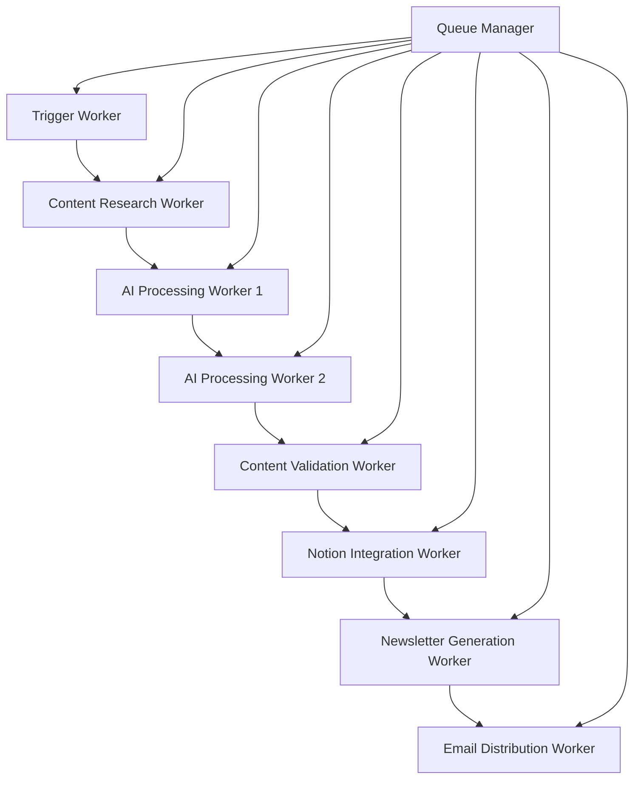

# ContainerCode Comprehensive Testing & Automation Plan

## 🎯 Executive Summary

Based on my analysis of your codebase, I've identified a sophisticated Next.js application with Cloudflare Workers integration, Notion API content management, and existing testing infrastructure. This plan outlines a comprehensive approach to implement end-to-end UAT testing, content automation, and AI-powered newsletter generation with proper task distribution across Cloudflare Workers.

## 📊 Current Architecture Analysis

### Existing Infrastructure
- **Frontend**: Next.js 14 with TypeScript, Tailwind CSS
- **Backend**: Cloudflare Workers with multiple bindings
- **Database**: D1 (SQLite), KV storage, R2 buckets
- **Content Management**: Notion API integration
- **Testing**: Playwright, Puppeteer, Jest
- **AI Integration**: DeepSeek, Gemini, Cloudflare AI
- **Email**: Resend API for newsletters

### Current Workers Structure
```
workers/
├── article-generator.js (46KB) - Main content generation
├── newsletter-generator.js (13KB) - Newsletter distribution  
├── utils/
│   ├── content-generator.js (19KB) - AI content creation
│   ├── content-validator.js (18KB) - British English validation
│   ├── notion-client.js (17KB) - Notion API integration
│   ├── newsletter-generator.js (22KB) - Newsletter templates
│   ├── image-generator.js (15KB) - AI image creation
│   ├── email-sender.js (15KB) - Email distribution
│   └── rss-parser.js (9KB) - RSS feed processing
```

### Current Testing Infrastructure
```
tests/
├── puppeteer-uat-enhanced.js (27KB) - Comprehensive UAT testing
├── api-smoke-testing.js (21KB) - API endpoint testing
├── stress-testing-newsletter.js (21KB) - Load testing
├── comprehensive-testing.js (12KB) - Full test suite
└── Various Playwright specs
```

## 🚀 Proposed Solution Architecture

### 1. Distributed Worker Pipeline for AI Processing

To solve the DeepSeek 3-minute processing vs Cloudflare's 15-second limit:



### 2. Enhanced Testing Strategy

#### A. End-to-End UAT Testing with Puppeteer
- **Content Flow Testing**: Verify entire content pipeline from RSS → AI → Notion → Newsletter
- **User Journey Testing**: Test all website interactions, forms, and content consumption
- **Cross-browser Testing**: Ensure compatibility across different browsers
- **Performance Testing**: Monitor Core Web Vitals and loading times

#### B. Aggressive Testing Scenarios
- **Load Testing**: Simulate high traffic and concurrent users
- **Stress Testing**: Push system beyond normal limits
- **Chaos Engineering**: Introduce failures to test resilience
- **Security Testing**: Validate input sanitization and API security

#### C. Content Validation Testing
- **British English Validation**: Automated grammar and style checking
- **SEO Testing**: Verify meta tags, structured data, and content optimization
- **Accessibility Testing**: Ensure WCAG compliance
- **Image Optimization Testing**: Validate image loading and optimization

## 📋 Implementation Plan

### Phase 1: Worker Pipeline Redesign (Week 1-2)

#### 1.1 Create Distributed Workers
```javascript
// workers/pipeline/
├── trigger-worker.js          // Initiates the pipeline
├── research-worker.js         // Brave API search & data collection
├── ai-processing-worker-1.js  // Initial AI processing (chunked)
├── ai-processing-worker-2.js  // Secondary AI processing
├── validation-worker.js       // Content validation & formatting
├── notion-worker.js          // Notion API integration
├── newsletter-worker.js      // Newsletter generation
└── distribution-worker.js    // Email distribution
```

#### 1.2 Queue Management System
```javascript
// workers/utils/queue-manager.js
class WorkerQueue {
  async enqueue(workerName, payload, delay = 0) {
    // Use KV storage for queue management
    // Implement retry logic and error handling
  }
  
  async processNext(workerName) {
    // Process next item in queue
    // Handle worker-to-worker communication
  }
}
```

### Phase 2: Enhanced Testing Infrastructure (Week 2-3)

#### 2.1 Comprehensive Puppeteer UAT Suite
```javascript
// tests/enhanced-uat/
├── content-pipeline-test.js   // Full content flow testing
├── user-journey-test.js       // Complete user experience testing
├── performance-test.js        // Core Web Vitals monitoring
├── accessibility-test.js      // WCAG compliance testing
├── security-test.js          // Security vulnerability testing
└── cross-browser-test.js     // Multi-browser compatibility
```

#### 2.2 Automated Content Quality Assurance
```javascript
// tests/content-qa/
├── british-english-validator.js  // Grammar and style validation
├── seo-validator.js              // SEO optimization testing
├── image-optimization-test.js    // Image loading and optimization
├── notion-content-validator.js   // Notion API content verification
└── newsletter-template-test.js   // Email template testing
```

### Phase 3: AI-Powered Automation (Week 3-4)

#### 3.1 Intelligent Content Generation
```javascript
// workers/ai-enhanced/
├── content-research-ai.js     // AI-powered research and fact-checking
├── content-optimization-ai.js // SEO and readability optimization
├── image-generation-ai.js     // Automated image creation and optimization
└── newsletter-personalization.js // Personalized newsletter content
```

#### 3.2 Automated Testing with AI
```javascript
// tests/ai-testing/
├── ai-content-validator.js    // AI-powered content quality assessment
├── automated-test-generator.js // Generate tests based on content changes
├── performance-predictor.js   // Predict performance issues
└── user-behavior-simulator.js // Simulate realistic user interactions
```

## 🔧 Technical Implementation Details

### 1. Worker Communication Pattern
```javascript
// Implement using Cloudflare's Service Bindings
export default {
  async fetch(request, env) {
    const { pathname } = new URL(request.url);
    
    switch (pathname) {
      case '/trigger':
        return await this.triggerPipeline(request, env);
      case '/process':
        return await this.processContent(request, env);
      case '/validate':
        return await this.validateContent(request, env);
      default:
        return new Response('Not found', { status: 404 });
    }
  },
  
  async triggerPipeline(request, env) {
    // Start the content generation pipeline
    const payload = await request.json();
    
    // Queue first worker
    await env.QUEUE.send({
      type: 'RESEARCH',
      data: payload,
      timestamp: Date.now()
    });
    
    return new Response('Pipeline triggered', { status: 200 });
  }
};
```

### 2. Enhanced Testing Framework
```javascript
// tests/framework/enhanced-testing.js
class EnhancedTestSuite {
  constructor() {
    this.browser = null;
    this.page = null;
    this.testResults = [];
  }
  
  async runComprehensiveTests() {
    await this.setupBrowser();
    
    // Run all test categories
    await this.runContentPipelineTests();
    await this.runUserJourneyTests();
    await this.runPerformanceTests();
    await this.runAccessibilityTests();
    await this.runSecurityTests();
    
    await this.generateReport();
  }
  
  async runContentPipelineTests() {
    // Test entire content generation flow
    // Verify RSS parsing → AI processing → Notion → Newsletter
  }
  
  async runUserJourneyTests() {
    // Test all user interactions
    // Forms, navigation, content consumption
  }
}
```

### 3. Content Quality Automation
```javascript
// workers/utils/content-quality.js
class ContentQualityManager {
  async validateBritishEnglish(content) {
    // Use AI to ensure British English formatting
    // Check spelling, grammar, and style
  }
  
  async optimizeForSEO(content) {
    // Analyze and optimize content for search engines
    // Generate meta descriptions, titles, and structured data
  }
  
  async generateImages(content) {
    // Create relevant images using AI
    // Optimize for web performance
  }
}
```

## 📊 Monitoring & Analytics

### 1. Performance Monitoring
```javascript
// scripts/monitoring/performance-monitor.js
class PerformanceMonitor {
  async monitorCoreWebVitals() {
    // Track LCP, FID, CLS, TTFB
    // Alert on performance degradation
  }
  
  async monitorWorkerPerformance() {
    // Track worker execution times
    // Monitor queue lengths and processing delays
  }
}
```

### 2. Content Analytics
```javascript
// workers/analytics/content-analytics.js
class ContentAnalytics {
  async trackContentPerformance() {
    // Monitor content engagement
    // Track newsletter open rates and click-through rates
  }
  
  async analyzeUserBehavior() {
    // Understand user interaction patterns
    // Optimize content based on user preferences
  }
}
```

## 🎯 Success Metrics

### Testing Metrics
- **Test Coverage**: >95% code coverage
- **Test Execution Time**: <10 minutes for full suite
- **Flaky Test Rate**: <2%
- **Bug Detection Rate**: >90% of issues caught before production

### Performance Metrics
- **Core Web Vitals**: All metrics in "Good" range
- **Worker Response Time**: <500ms average
- **Content Generation Time**: <5 minutes end-to-end
- **Newsletter Delivery Rate**: >98%

### Content Quality Metrics
- **Grammar Score**: >95% accuracy
- **SEO Score**: >90% optimization
- **User Engagement**: >20% increase in newsletter engagement
- **Content Freshness**: Daily content updates

## 🚀 Next Steps

1. **Immediate Actions** (This Week)
   - Set up distributed worker architecture
   - Implement queue management system
   - Create enhanced Puppeteer test suite

2. **Short Term** (Next 2 Weeks)
   - Deploy content quality automation
   - Implement AI-powered testing
   - Set up comprehensive monitoring

3. **Long Term** (Next Month)
   - Optimize performance based on metrics
   - Expand testing coverage
   - Implement advanced AI features

## 📁 File Structure for Implementation

```
/containercode-app/
├── workers/
│   ├── pipeline/              # Distributed worker pipeline
│   ├── ai-enhanced/          # AI-powered automation
│   └── analytics/            # Performance and content analytics
├── tests/
│   ├── enhanced-uat/         # Comprehensive UAT testing
│   ├── content-qa/           # Content quality assurance
│   ├── ai-testing/           # AI-powered testing
│   └── framework/            # Testing framework utilities
├── scripts/
│   ├── monitoring/           # Performance monitoring
│   ├── automation/           # Content automation
│   └── deployment/           # Deployment automation
└── docs/
    ├── testing-guide.md      # Testing documentation
    ├── worker-architecture.md # Worker pipeline documentation
    └── content-strategy.md   # Content automation strategy
```

This comprehensive plan addresses all your requirements for end-to-end testing, content automation, and AI-powered newsletter generation while solving the DeepSeek processing time limitation through distributed worker architecture.