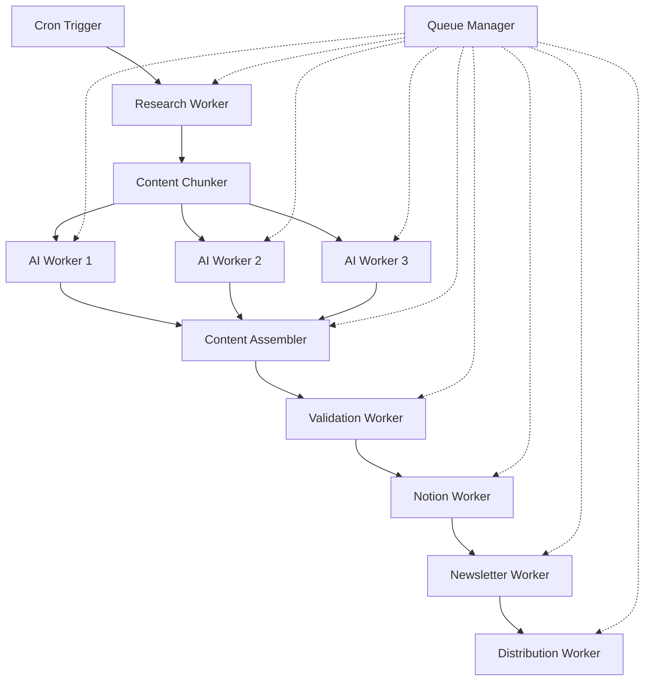

# Cloudflare Workers Pipeline Architecture

## 🏗️ Distributed Worker System Design

### Problem Statement
- **DeepSeek AI Processing**: 3-minute thinking time
- **Cloudflare Worker Limit**: 15-second execution time
- **Solution**: Break processing into interdependent worker chains

## 🔄 Pipeline Flow Architecture



## 📋 Worker Specifications

### 1. Research Worker (`research-worker.js`)
**Purpose**: Gather content from RSS feeds and search APIs
**Execution Time**: ~5 seconds
**Bindings**: KV, Brave API, RSS feeds

```javascript
export default {
  async fetch(request, env) {
    const sources = await this.gatherSources(env);
    const searchResults = await this.searchBraveAPI(sources, env);
    
    // Chunk content for parallel processing
    const chunks = this.chunkContent(searchResults, 3);
    
    // Queue AI workers
    for (let i = 0; i < chunks.length; i++) {
      await env.QUEUE.send({
        type: 'AI_PROCESS',
        workerId: i + 1,
        chunk: chunks[i],
        sessionId: crypto.randomUUID()
      });
    }
    
    return new Response('Research completed', { status: 200 });
  }
};
```

### 2. AI Processing Workers (`ai-worker-1.js`, `ai-worker-2.js`, `ai-worker-3.js`)
**Purpose**: Process content chunks with DeepSeek AI
**Execution Time**: ~12 seconds each (parallel)
**Bindings**: DeepSeek API, KV storage

```javascript
export default {
  async fetch(request, env) {
    const { chunk, sessionId, workerId } = await request.json();
    
    // Process with DeepSeek (within time limit)
    const processedContent = await this.processWithDeepSeek(chunk, env);
    
    // Store result in KV
    await env.KV_BINDING.put(
      `processed_${sessionId}_${workerId}`,
      JSON.stringify(processedContent),
      { expirationTtl: 3600 }
    );
    
    // Check if all workers completed
    const completed = await this.checkAllCompleted(sessionId, env);
    if (completed) {
      await this.triggerAssembler(sessionId, env);
    }
    
    return new Response('AI processing completed', { status: 200 });
  }
};
```

### 3. Content Assembler (`assembler-worker.js`)
**Purpose**: Combine processed chunks into final content
**Execution Time**: ~3 seconds
**Bindings**: KV storage

```javascript
export default {
  async fetch(request, env) {
    const { sessionId } = await request.json();
    
    // Retrieve all processed chunks
    const chunks = await this.retrieveChunks(sessionId, env);
    
    // Assemble final content
    const finalContent = await this.assembleContent(chunks);
    
    // Queue validation worker
    await env.QUEUE.send({
      type: 'VALIDATE',
      content: finalContent,
      sessionId
    });
    
    return new Response('Content assembled', { status: 200 });
  }
};
```

### 4. Validation Worker (`validation-worker.js`)
**Purpose**: Validate British English and content quality
**Execution Time**: ~8 seconds
**Bindings**: Cloudflare AI, KV storage

```javascript
export default {
  async fetch(request, env) {
    const { content, sessionId } = await request.json();
    
    // British English validation
    const validatedContent = await this.validateBritishEnglish(content, env);
    
    // SEO optimization
    const optimizedContent = await this.optimizeSEO(validatedContent, env);
    
    // Queue Notion worker
    await env.QUEUE.send({
      type: 'NOTION_CREATE',
      content: optimizedContent,
      sessionId
    });
    
    return new Response('Content validated', { status: 200 });
  }
};
```

### 5. Notion Integration Worker (`notion-worker.js`)
**Purpose**: Create Notion pages and manage content
**Execution Time**: ~10 seconds
**Bindings**: Notion API, R2 buckets

```javascript
export default {
  async fetch(request, env) {
    const { content, sessionId } = await request.json();
    
    // Generate images
    const images = await this.generateImages(content, env);
    
    // Upload to R2
    const imageUrls = await this.uploadImages(images, env);
    
    // Create Notion page
    const notionPage = await this.createNotionPage(content, imageUrls, env);
    
    // Queue newsletter worker
    await env.QUEUE.send({
      type: 'NEWSLETTER_GENERATE',
      notionPageId: notionPage.id,
      sessionId
    });
    
    return new Response('Notion page created', { status: 200 });
  }
};
```

## 🔧 Queue Management System

### Queue Manager (`queue-manager.js`)
```javascript
class WorkerQueue {
  constructor(env) {
    this.env = env;
    this.retryLimit = 3;
  }
  
  async enqueue(message, delay = 0) {
    const messageId = crypto.randomUUID();
    const queueItem = {
      id: messageId,
      ...message,
      timestamp: Date.now(),
      retryCount: 0,
      delay
    };
    
    if (delay > 0) {
      // Schedule for later execution
      await this.env.KV_BINDING.put(
        `scheduled_${messageId}`,
        JSON.stringify(queueItem),
        { expirationTtl: delay + 3600 }
      );
    } else {
      // Execute immediately
      await this.processMessage(queueItem);
    }
  }
  
  async processMessage(message) {
    try {
      const workerUrl = this.getWorkerUrl(message.type);
      const response = await fetch(workerUrl, {
        method: 'POST',
        headers: { 'Content-Type': 'application/json' },
        body: JSON.stringify(message)
      });
      
      if (!response.ok) {
        throw new Error(`Worker failed: ${response.status}`);
      }
    } catch (error) {
      await this.handleRetry(message, error);
    }
  }
  
  async handleRetry(message, error) {
    if (message.retryCount < this.retryLimit) {
      message.retryCount++;
      const delay = Math.pow(2, message.retryCount) * 1000; // Exponential backoff
      
      setTimeout(() => {
        this.processMessage(message);
      }, delay);
    } else {
      // Log failure and alert
      console.error('Message failed after retries:', message, error);
      await this.alertFailure(message, error);
    }
  }
}
```

## 🔄 Worker Communication Patterns

### 1. Service Bindings Configuration
```toml
# wrangler.toml for each worker
[[services]]
binding = "RESEARCH_WORKER"
service = "research-worker"

[[services]]
binding = "AI_WORKER_1"
service = "ai-worker-1"

[[services]]
binding = "VALIDATION_WORKER"
service = "validation-worker"
```

### 2. Inter-Worker Communication
```javascript
// In any worker
async function callNextWorker(env, data) {
  const response = await env.NEXT_WORKER.fetch(
    new Request('https://worker/process', {
      method: 'POST',
      headers: { 'Content-Type': 'application/json' },
      body: JSON.stringify(data)
    })
  );
  
  return await response.json();
}
```

## 📊 Monitoring & Error Handling

### 1. Worker Health Monitoring
```javascript
// monitoring-worker.js
export default {
  async fetch(request, env) {
    const healthChecks = await Promise.allSettled([
      this.checkWorker('research-worker', env),
      this.checkWorker('ai-worker-1', env),
      this.checkWorker('validation-worker', env),
      this.checkWorker('notion-worker', env)
    ]);
    
    const report = this.generateHealthReport(healthChecks);
    
    if (report.failedWorkers.length > 0) {
      await this.alertAdmins(report, env);
    }
    
    return new Response(JSON.stringify(report), {
      headers: { 'Content-Type': 'application/json' }
    });
  }
};
```

### 2. Error Recovery Strategies
```javascript
class ErrorRecovery {
  async handleWorkerFailure(workerName, sessionId, env) {
    switch (workerName) {
      case 'ai-worker':
        // Retry with different AI model
        await this.retryWithFallbackAI(sessionId, env);
        break;
      case 'notion-worker':
        // Retry Notion API call
        await this.retryNotionOperation(sessionId, env);
        break;
      default:
        // Generic retry logic
        await this.genericRetry(workerName, sessionId, env);
    }
  }
}
```

## 🚀 Deployment Strategy

### 1. Gradual Rollout
```bash
# Deploy workers in dependency order
wrangler deploy --name research-worker
wrangler deploy --name ai-worker-1
wrangler deploy --name ai-worker-2
wrangler deploy --name ai-worker-3
wrangler deploy --name assembler-worker
wrangler deploy --name validation-worker
wrangler deploy --name notion-worker
wrangler deploy --name newsletter-worker
wrangler deploy --name distribution-worker
```

### 2. Environment Configuration
```javascript
// Environment-specific configurations
const config = {
  development: {
    aiTimeout: 15000,
    retryLimit: 2,
    queueDelay: 1000
  },
  production: {
    aiTimeout: 12000,
    retryLimit: 3,
    queueDelay: 500
  }
};
```

## 📈 Performance Optimization

### 1. Parallel Processing
- **AI Workers**: Run 3 workers in parallel for content chunks
- **Image Generation**: Parallel image creation and upload
- **Validation**: Concurrent grammar and SEO checks

### 2. Caching Strategy
```javascript
// Implement intelligent caching
class CacheManager {
  async getCachedContent(key, env) {
    const cached = await env.KV_BINDING.get(key);
    if (cached) {
      const data = JSON.parse(cached);
      if (Date.now() - data.timestamp < data.ttl) {
        return data.content;
      }
    }
    return null;
  }
  
  async setCachedContent(key, content, ttl, env) {
    await env.KV_BINDING.put(key, JSON.stringify({
      content,
      timestamp: Date.now(),
      ttl
    }), { expirationTtl: ttl });
  }
}
```

This architecture solves the DeepSeek processing time limitation while maintaining reliability and scalability through distributed worker processing.